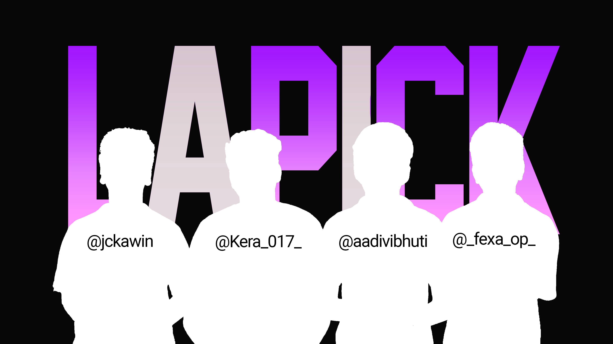

#  L<i>**a**</i>P<i>**i**</i>CK

## 🚀 The Ultimate AI Laptop Guru: Lapick 🤖✨

Welcome to Lapick — not just another laptop finder, but your personal AI-powered tech oracle. Lapick harnesses the power of next-generation artificial intelligence, blending the wisdom of a fine-tuned LLM with the relentless speed of real-time data scraping. Imagine an AI that not only understands your needs, but anticipates them, scours the digital universe for the latest laptops, and delivers recommendations with the precision of a seasoned expert. 🧠💡

We have a very big project, a very powerful industry standard scrapper for amazon which is fine tuned to scrap laptops, docker searnxg for best searches, optimized frontend in Nextjs, using ai to optimize our results and scrapping

Lapick’s AI doesn’t just process data — it thinks, reasons, and adapts. It learns from every user, every query, and every trend, evolving into the ultimate laptop matchmaker. Whether you’re a hardcore gamer 🎮, a creative professional 🎨, or a student on the go 🎒, Lapick’s AI integration ensures you get a laptop recommendation that feels almost telepathic. 🔮

With Lapick, you’re not just searching — you’re experiencing the future of intelligent tech shopping, where artificial intelligence becomes your trusted companion in the quest for the perfect device. 🚀🛒

---

Lapick is an AI-powered laptop recommendation platform designed to simplify the process of finding the perfect laptop for your needs. It combines a fine-tuned large language model (LLM) with real-time data scraping and intelligent filtering to deliver highly relevant laptop suggestions. Here are some key features and details about the project:

- **🗣️ Conversational AI:** The system interacts with users in natural language, asking about their requirements such as budget, usage (gaming, programming, content creation, etc.), portability, and performance needs.
- **🏷️ Brand Filtering:** Only reputed brands are considered (ASUS, DELL, MSI, ACER, HP, LENOVO) to ensure quality and reliability.
- **⏱️ Real-Time Data:** The backend uses Node.js and Python scripts to scrape and process the latest laptop listings and specifications from trusted sources.
- **🎯 Personalized Recommendations:** The LLM processes user input and tech stack to suggest laptops that best match the user's profile, making the search process fast and accurate.
- **🖥️ User-Friendly Interface:** Built with Next.js and React, the frontend provides an engaging and intuitive experience, including interactive UI elements and visual effects.
- **🌍 For Everyone:** Whether you're a college student or a professional, Lapick helps you find a laptop tailored to your tech stack and preferences.

This project was created as a hackathon entry by Gunit, Aadi, JCKawin, and Keerthik Ram, with the goal of making laptop selection smarter and more efficient.
# ⚙️ Requirements

A Computer With Operating System Installed And A Proper Internet Connection.<br>
Install Node.js and Git for running this.

# 🛠️ Tech Stacks

[](https://nodejs.org/en) [](https://nextjs.org/) [](https://react.dev/)  [](https://www.python.org/downloads/)  [](https://git-scm.com/downloads)

# ▶️ How To RUN This?

1. Clone This REPO with **<code>git clone https://github.com/JCKawin/Lapick.git </code>** command
2. Open the cloned repo in Powershell and run the command <code>npm install</code> which will install all the required packages
3. Then run the command <code>npm run dev</code> to host the web application and open the https address .
4. TADA !!! Now you are good to Go.

>  If you have Any Issues Contact Us in [](https://www.instagram.com/jckawin/)

# 🤔 What this Does?

We've developed a web application using Next.js for the frontend and Node.js for the backend that leverages a large language model (LLM) to help users find the best laptop based on their specific preferences. By simply describing their needs—such as budget, usage (e.g., gaming, programming, content creation), portability, and performance—the LLM intelligently processes the input and suggests the most suitable laptops. The system combines natural language understanding with real-time data handling to deliver accurate, user-focused recommendations, streamlining what is usually a time-consuming research process into a fast, conversational experience.

This Ease the process of searching for the right laptop for hours in media , Our llm is Fine tuned to get the prefect combination of the  laptop.

We have made our AI to go through Only the Reputed Brands (Like ASUS , DELL , MSI , ACER , HP , LENOVO)

College Students Or Even Profesionals Can use this to find the prefect laptop for thier tech stacks.

# 🔍 How does it Works? (A Glimpse)

It Asks you few questions on what do you use and what you are going to use . <br>

Then process the given tech Stack and Gets you a prefect laptop craved and tuned just for you.

# 🤖 How Does a Fine-Tuned LLM for Laptop Recommendation Work?

A fine-tuned Large Language Model (LLM) for laptop recommendation is an advanced AI system that has been specifically trained on a large dataset of laptop specifications, user preferences, reviews, and buying patterns. Here’s how it works in Lapick:

1. **Understanding User Needs:**
   - The LLM asks users about their requirements, such as budget, primary use cases (gaming, programming, content creation, etc.), preferred brands, portability, and any specific features they want.
   - It interprets natural language input, so users can describe their needs in their own words.

2. **Processing and Matching:**
   - The model analyzes the user’s responses and extracts key requirements.
   - It compares these needs against a database of laptops, which is kept up-to-date using real-time web scraping and data aggregation.
   - The LLM uses its training to understand which laptop features best match different user profiles (e.g., a gamer needs a high-refresh-rate display and a powerful GPU, while a student may prioritize battery life and portability).

3. **Personalized Recommendation:**
   - The LLM ranks and filters laptops based on how well they fit the user’s criteria.
   - It explains its recommendations, highlighting why certain models are a good fit.
   - The system can also answer follow-up questions, refine suggestions, or adapt to new preferences in real time.

4. **Continuous Improvement:**
   - The model can be further fine-tuned with new data, user feedback, and evolving laptop trends, making its recommendations smarter over time.

By leveraging a fine-tuned LLM, Lapick delivers highly accurate, context-aware, and user-friendly laptop recommendations, making the selection process fast, transparent, and tailored to each individual. 💡💻


# 🛒 Industry-Standard Amazon Scraper for the Best Deals

Lapick doesn't just stop at recommending the perfect laptop combination for your needs — it goes a step further by integrating an industry-level Amazon scraper. This powerful tool is designed to fetch the best real-time deals for your recommended laptop, ensuring you get the most value for your money. 🔍💸

## 🏆 What Makes Our Amazon Scraper Special?

- **Stealthy & Reliable:** Built with Puppeteer and advanced stealth plugins, our scraper mimics real user behavior, bypasses anti-bot protections, and fetches accurate, up-to-date listings and prices directly from Amazon.
- **Smart User-Agent Rotation:** Randomizes user agents and simulates mouse movements to avoid detection, ensuring robust and continuous operation.
- **Detailed Data Extraction:** Gathers product prices, images, specifications, and more, so you get a complete picture of every deal.
- **Proxy Support:** Optionally routes traffic through Tor for enhanced privacy and access.

## � How It Works

1. **Get Your Laptop Recommendation:**
   - Use Lapick’s AI-powered interface to describe your needs and receive a personalized laptop recommendation.
2. **Run the Amazon Scraper:**
   - Feed the recommended laptop model or URL into the Amazon scraper.
   - The scraper will search Amazon, extract the latest prices, product details, and images, and present you with the best available deals.
3. **Review & Buy:**
   - Instantly see the most competitive offers and make your purchase with confidence!

## 🛠️ How to Use the Amazon Scraper

**Requirements:**
- Node.js (v16 or higher recommended)
- Python (if using additional scripts)
- A stable internet connection
- (Optional) Tor installed and running for proxy support

**Installation:**
1. Open a terminal in the project root directory.
2. Install dependencies:
   ```sh
   cd frontend
   npm i
   ```
3. (Optional) If you want to use Tor proxy, ensure Tor is running on your system.

**Running the Scraper:**
1. Navigate to the Amazon scraper directory:
   ```sh
   cd amazon
   npm i
   ```
2. Edit `amazon-scraper.js` if you want to change the target laptop URL or enable proxy support (set `USE_PROXY = true`).
3. Run the scraper:
   ```sh
   node amazon-scraper.js
   ```
4. The scraper will launch, fetch the latest details and prices for the specified laptop, and print the results in your terminal.

**Tips:**
- You can modify the script to scrape multiple laptops or automate the process for a list of recommendations.
- For best results, always use the latest version of Node.js and keep dependencies updated.

With Lapick’s Amazon scraper, you move seamlessly from getting the perfect laptop recommendation to securing the best deal — all in one intelligent workflow! 🛒🤖💰
